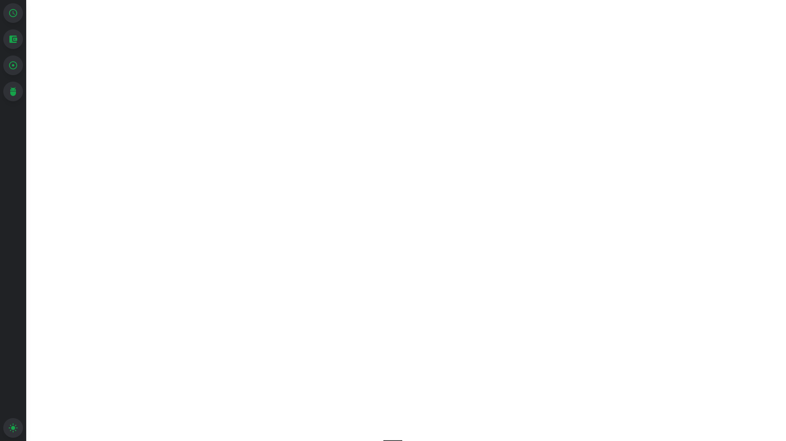

# React Sidebar Navigation with Dark/Light Mode

This React component leverages TailwindCSS to deliver a sleek sidebar navigation with interactive icons, including the ability to switch between dark and light modes. **Inspired by Discord's navigation bar.**




## Features

- 🌒 Smooth switch between dark and light mode with the bottom icon
- 🚀 Built with TailwindCSS for fast and efficient styling
- 🎨 Uses [Material-UI icons](https://mui.com/material-ui/material-icons/).
- 📱 Responsive and mobile-friendly
- 🔍 Tooltips for each icon's description
- 👁️ Stylish design and animations

## Installation

1. Ensure you have Node.js and npm or yarn installed.
2. Clone this repository:

```bash
git clone [repository_url] react-sidebar-navigation
cd react-sidebar-navigation
```

3. Install the dependencies:

```bash
npm install
```

4. Run the project:

```bash
npm run dev
```

The project should now be running at `[http://localhost:5173]` as Vite chooses that port.

## Usage

Import the sidebar navigation component and use it within your component or page:

```javascript
import SidebarNavigation from './components/SideBarNavigation';

function App() {
  return (
    <div className="App">
      <SidebarNavigation />
      {/* other components */}
    </div>
  );
}
```

## Customization

To customize the icons or add new ones, simply edit the related sidebar navigation file.
- **Adding a New Icon** 🎨: 
    1. 🌐 Visit [Material-UI icons](https://mui.com/material-ui/material-icons/).
    2. 🔍 Search for an icon of your preference.
    3. 🖱️ Click on the desired icon.
    4. 📋 Copy the 'import code' provided.
    5. 📥 Paste it in your component and use it as needed.

## Contributing

Contributions are welcome. Please open an issue or make a pull request if you wish to add features or fix bugs.

## License

MIT
